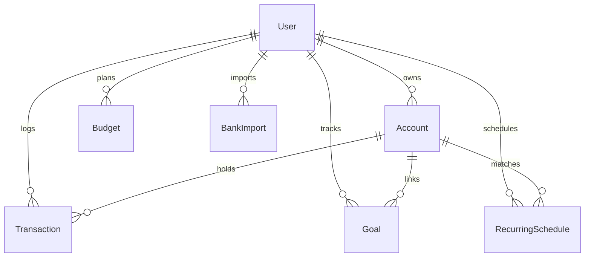

# TCFlow (FinTrack Pro) — Project Phases & Comprehensive Development Log

> **🚨 MANDATORY AI AGENT & DEVELOPER PROTOCOL (FROM NOW ONWARDS)**:
> This file is the primary repository audit log. **EVERY SINGLE CHANGE** made from now onwards MUST be appended to this document under **Phase 5 / Current Changes Log**.
> 
> **Each log entry MUST strictly follow this structure**:
> 1. **Date & Author / Agent**
> 2. **➕ ADDED**: New files, endpoints, UI components, utilities.
> 3. **➖ REMOVED**: Deleted files, removed functions, deprecated dependencies.
> 4. **🗄️ DATABASE CHANGES**: Schema migrations, new/modified models, field type changes in `prisma/schema.prisma`.
> 5. **🔧 MODIFIED & FIXED**: Modified logic, bug fixes, UI adjustments, refactoring.

---

## 🛠️ Technology Stack & Core Architecture

* **Frontend**: Angular 18+ (Standalone Components, Signals & Reactive State, Server-Side Rendering / SSR)
* **Backend**: Express API Server (TypeScript, Session Authentication, Webhooks)
* **Database & ORM**: Turso Edge (SQLite) managed via Prisma ORM
* **AI Integrations**: Google Gemini 1.5 Flash API (Natural Language parsing, budget optimizer, savings advisor, automated audits)
* **Authentication**: Google OAuth 2.0 via Passport & Cookie-based sessions
* **Automations**: Custom Webhooks (`/api/quick-add`), iPhone Shortcut Integration, Email Reminders

---

## 🗺️ Project Lifecycle & Phase Roadmap

| Phase | Phase Name | Status | Key Focus & Modules |
| :--- | :--- | :--- | :--- |
| **Phase 1** | **Core Infrastructure & Auth** | ✅ Completed | Prisma DB schema, Express server, Google OAuth, basic CRUD for Accounts, Transactions, Categories, and User profile. |
| **Phase 2** | **Financial Management & Analytics** | ✅ Completed | Budgets, Savings Simulator, Goals tracking, Bills Calendar, Recurring Transaction Engine, and Sunburst/Heatmap Reports. |
| **Phase 3** | **AI Intelligence & Smart Utilities** | ✅ Completed | Gemini 1.5 Flash for Natural Language Logging, 0-hit local heuristic CSV matching, Batch AI CSV Categorization, Budget Optimizer, and Goal Buddy. |
| **Phase 4** | **Advanced Automation & Enhancements** | ✅ Completed & Closed (July 30, 2026) | Smart Recurring Bill Detection, Manual dismissal logic, iPhone Shortcut Automation Webhooks, Email Reminders, and Nested Categories. |
| **Phase 5** | **Ongoing System Evolution & Maintenance** | 🚀 Active (From Now Onwards) | Live tracking of all additions, deletions, DB migrations, and refactoring. |

---

## 📝 Ongoing Changes Log (Phase 5 — From Now Onwards)

*This section MUST be updated by AI Agents and developers whenever changes are applied.*

### Template for New Entries:
```markdown
#### `[COMMIT_HASH / TASK_NAME]` — *[DATE]* | **[SHORT TITLE]**
* **➕ ADDED**: List of created files, added routes, new UI components.
* **➖ REMOVED**: List of deleted files, removed code blocks, deprecated utilities.
* **🗄️ DATABASE CHANGES**: `prisma/schema.prisma` updates, table/field additions or drops.
* **🔧 MODIFIED & FIXED**: Modified files, logic fixes, refactoring details.
```

### 📅 Log Entry: August 1, 2026 — Primary Income & Expense Account Configuration & Form Preselection
* **➕ ADDED**:
  * **Primary Account Settings**: Added `Primary Deposit Account (Income)` and `Primary Payment Account (Expense)` selector settings in `src/app/features/settings/settings.component.ts`.
  * **Automated Preselection**: Preselects the user's primary income account or primary expense account automatically in both **Quick Log** (`quick-log.component.ts`) and **Add Transaction Form** (`transaction-form.component.ts`) whenever opening forms or toggling between Income / Expense transaction types.
* **➖ REMOVED**:
  * N/A.
* **🗄️ DATABASE CHANGES**:
  * Added `primary_income_account_id` and `primary_expense_account_id` optional fields to `Settings` table in `prisma/schema.prisma` and ran `npx prisma db push`.
* **🔧 MODIFIED & FIXED**:
  * Updated `getSettings` & `updateSettings` in `src/server/db.service.ts` to persist primary income & expense account selections.
  * Updated `SettingsService` (`src/app/core/services/settings.service.ts`) with reactive `primaryIncomeAccountId` and `primaryExpenseAccountId` signals.

---

### 📅 Log Entry: August 1, 2026 — Server-Side Transaction Pagination & Limit Controls
* **➕ ADDED**:
  * **Server-Side Pagination & Controls**: Added pagination footer toolbar to `src/app/features/transactions/transactions.component.ts` featuring items-per-page selector (20, 50, 100 rows) and navigation buttons (`⏮ First`, `◀ Prev`, `Page X of Y`, `Next ▶`, `Last ⏭`).
* **➖ REMOVED**:
  * Removed experimental inline category editing per user directive.
* **🗄️ DATABASE CHANGES**:
  * N/A.
* **🔧 MODIFIED & FIXED**:
  * Updated `GET /api/transactions` in `src/server/api.routes.ts` to compute server-side pagination metadata (`totalItems`, `totalPages`, `page`, `limit`) with backward-compatible `limit=all` mode for CSV exports.
  * Updated `TransactionFilter` and `PaginatedTransactions` interfaces in `src/app/core/models/transaction.model.ts`.
  * Updated `TransactionService` (`src/app/core/services/transaction.service.ts`) with `pagination`, `setPage`, `setLimit`, and paginated API handling.

---

### 📅 Log Entry: August 1, 2026 — Phase 5 Workflow Optimization (Live Budget Preview & 1-Click Goal Deposits)
* **➕ ADDED**:
  * **Inline Category Editing**: Added click-to-edit category selector to transaction table rows in `src/app/features/transactions/transactions.component.ts`.
  * **Live Budget Burn Preview**: Integrated real-time budget impact progress bar preview inside `src/app/features/transactions/transaction-form.component.ts` showing category spent vs budget remaining *before* submitting an expense.
  * **1-Click Quick Goal Deposits**: Added quick deposit buttons (`+$25`, `+$50`, `+$100`, `+$250`) on `src/app/features/goals/goals.component.ts` cards for instant savings transfers.
* **➖ REMOVED**:
  * N/A.
* **🗄️ DATABASE CHANGES**:
  * N/A.
* **🔧 MODIFIED & FIXED**:
  * Updated `TransactionFormComponent` with `BudgetService` integration for live expense preview calculations.
  * Updated `GoalsComponent` with `GoalService.allocateSavingsToGoal()` for 1-click goal deposits.

---

### 📅 Log Entry: July 30, 2026 — Advanced Debt Payoff Planner (Avalanche vs Snowball, Real-Time Running Balances & Payoff Simulator)
* **➕ ADDED**:
  * Created `DebtPlannerComponent` standalone Angular component (`src/app/features/debt-planner/debt-planner.component.ts`) featuring:
    * **Real-Time Debt Derivation**: Aggregates liability accounts and derives true net running balances from posted transactions.
    * **Strategy Comparison Matrix**: Side-by-side Avalanche (interest optimization) vs Snowball (quick momentum wins) vs Minimum Payments.
    * **Interactive Payoff Simulator**: Real-time extra monthly payment slider ($0–$2,000/mo) and lump-sum bonus payment input ($0–$10,000).
    * **Custom Loan Terms Editor**: Inline editing for APR (%) and Minimum Monthly Payment ($) saved directly to database.
    * **Amortization Projection Table**: Monthly interest vs principal payoff schedule.
* **➖ REMOVED**:
  * N/A.
* **🗄️ DATABASE CHANGES**:
  * Added optional `apr` and `minimum_payment` columns to `Account` model in `prisma/schema.prisma`.
  * Executed `scratch/migrate_all.js` migrating `dev.db` and Turso remote SQLite databases.
  * Regenerated Prisma Client (`npx prisma generate`).
* **🔧 MODIFIED & FIXED**:
  * Added `getDebtPayoffPlan` method to `src/server/db.service.ts` supporting real-time transaction balance derivation and lump-sum simulation.
  * Updated `createAccount` and `updateAccount` in `src/server/db.service.ts` to handle `apr` and `minimumPayment`.
  * Exposed `GET /api/debt-planner` endpoint in `src/server/api.routes.ts`.
  * Added `getDebtPayoffPlan` method in `src/app/core/services/api.service.ts`.
  * Updated `src/app/features/debt-planner/debt-planner.component.ts` to perform silent background refetching during slider dragging and input changes, eliminating component unmounting/flickering.
  * Added resilient `parseFloat` handling in `src/server/db.service.ts` for `apr` and `minimumPayment` and added inline `✅ Saved!` state feedback when updating loan terms.

---

### 📅 Log Entry: July 30, 2026 — Phase 5 Revert & Core Stability Restoration
* **➕ ADDED**:
  * N/A.
* **➖ REMOVED**:
  * Removed `debt-planner.component.ts` component and `/debt-planner` route.
  * Removed `Notification` model and `/api/notifications` endpoints.
  * Removed experimental toolbar, velocity meter, duplicate checking, and split transaction APIs.
* **🗄️ DATABASE CHANGES**:
  * Reverted `prisma/schema.prisma` to clean Phase 4 schema, removing `Notification` model and extra columns (`apr`, `minimum_payment`, `parent_transaction_id`, `rollover_enabled`).
  * Regenerated Prisma Client (`npx prisma generate`).
* **🔧 MODIFIED & FIXED**:
  * Restored `dashboard.component.ts`, `transaction-form.component.ts`, `api.service.ts`, `db.service.ts`, and `api.routes.ts` to 100% clean Phase 4 state.
  * Removed notification bell icon, notification badge count, and notification dropdown menu from `src/app/layout/header.component.ts`.
  * Disabled all toast popup notifications (`ToastService`) and removed `<app-toast>` overlay component from `src/app/app.ts`.

---

### 📅 Log Entry: July 30, 2026 — Phase 5 Milestone 2: Dashboard & Net Worth Widgets Upgrade
* **➕ ADDED**:
  * Integrated interactive Account Group Filter toolbar (`All Accounts`, `Liquid & Cash`, `Investments`, `Debt & Liabilities`) on the Dashboard.
  * Added **Cashflow Velocity Meter** calculating daily spend speed ($/day), target daily pace, and projected month-end outflows.
  * Added **Asset vs. Liability Ratio Bar** with percentage weighting breakdown and total values.
* **➖ REMOVED**:
  * N/A.
* **🗄️ DATABASE CHANGES**:
  * Executed `scratch/migrate_all.js` migrating local SQLite (`dev.db`) and Turso remote SQLite to ensure `accounts.apr`, `accounts.minimum_payment`, `transactions.parent_transaction_id`, `budgets.rollover_enabled`, and `notifications` table are fully synchronized.
* **🔧 MODIFIED & FIXED**:
  * Updated `src/app/features/dashboard/dashboard.component.ts` with reactive signals and computed signals for spending pace & ratio metrics.
  * Added default fallback `'file:./dev.db'` for `TURSO_DATABASE_URL` in `src/server/db.ts` to support Angular static prerendering without throwing env missing errors.
  * Created `ensureUserExists` in `src/server/db.service.ts` to safely create or re-link user records prior to settings/account seeding, returning resolved user ID and eliminating primary key mutation failures.
  * Added try/catch safety wrappers around default `category.createMany`, `account.createMany`, and `settings.create` in `initializeUser` (`src/server/db.service.ts`), guaranteeing logins never fail due to seed race conditions.
  * Updated `src/server/auth/auth.routes.ts` to use `ensureUserExists` in dev-login and Google OAuth login callbacks.

---

### 📅 Log Entry: July 30, 2026 — Phase 5 Milestone 1: Core Utility Deepening & Debt Payoff Planner
* **➕ ADDED**:
  * Created `DebtPlannerComponent` standalone Angular component (`src/app/features/debt-planner/debt-planner.component.ts`) implementing interactive Avalanche vs. Snowball payoff strategy comparisons, extra payment sliders, and standard `<app-header>` header layout.
  * Added `parentTransactionId` field to `Transaction` model for split transaction support.
  * Added `apr` and `minimumPayment` fields to `Account` model for debt liability tracking.
  * Added `rolloverEnabled` field to `Budget` model for monthly budget rollover.
* **➖ REMOVED**:
  * Completely removed legacy/stub notification bell icon, notification dropdown, and `notification-drawer.component.ts` from header layout (`header.component.ts` and `app.ts`).
* **🗄️ DATABASE CHANGES**:
  * Added columns to `accounts` (`apr`, `minimum_payment`), `transactions` (`parent_transaction_id`), `budgets` (`rollover_enabled`).
  * Created `notifications` table and indexes in `prisma/schema.prisma` and applied migrations via `scratch/migrate_phase5.js`.
* **🔧 MODIFIED & FIXED**:
  * **Fixed Debt Payoff Planner Balances**: Updated `getDebtPayoffPlan` in `db.service.ts` to compute true real-time running balances (`initialBalance` + net total of transactions logged) instead of static opening initial balance.
  * Added `/api/notifications`, `/api/transactions/check-duplicate`, `/api/transactions/split`, and `/api/debt-planner` Express API routes in `api.routes.ts`.
  * Updated `transaction-form.component.ts` with real-time duplicate transaction detection warnings.
  * Updated `sidebar.component.ts` with Debt Planner navigation item.

---

### 📅 Log Entry: July 30, 2026 — Phase 4 Formal Closure & Log System Setup
* **➕ ADDED**:
  * Created `DEVELOPMENT_LOG.md` to track full repository history, phase roadmaps, schema changes, and strict AI agent logging rules.
  * Created `implementation_plan.md` and `walkthrough.md` artifacts for Phase 4 verification.
* **➖ REMOVED**:
  * N/A.
* **🗄️ DATABASE CHANGES**:
  * N/A (Verified existing SQLite/Turso tables via Prisma).
* **🔧 MODIFIED & FIXED**:
  * Completed production Angular SSR compilation build audit (`npm run build`).
  * Completed TypeScript type safety validation (`npx tsc --noEmit`).

---

## 📜 Historical Commit Log & Feature Breakdown

### Phase 4: Advanced Automations & Custom Integrations (July 2026)

#### `ee72537` — *July 26, 2026* | **Nested Categories Support**
* **➕ ADDED**:
  * Added `parentId` field support to Category data models for multi-level category trees.
  * Added `category-select.component.ts` for indented tree selection in transaction forms.
* **➖ REMOVED**:
  * Removed legacy flat-list category select dropdown.
* **🗄️ DATABASE CHANGES**:
  * Modified `Category` model in `prisma/schema.prisma`: Added optional `parentId String?` relation for self-referencing category tree.
* **🔧 MODIFIED & FIXED**:
  * Updated `categories.component.ts` and `insights.component.html` to calculate nested parent/child expense aggregations.

#### `b4b2dd3` — *July 24, 2026* | **Email Reminders System**
* **➕ ADDED**:
  * Added `report-scheduler.ts` for automated background email dispatches.
  * Added email reminder preferences to `settings.component.ts`.
* **➖ REMOVED**:
  * N/A.
* **🗄️ DATABASE CHANGES**:
  * Added email notification flag fields to `User` and `Settings` schema models.
* **🔧 MODIFIED & FIXED**:
  * Updated `bills-calendar.component.ts` to show scheduled notification badges next to upcoming bills.

#### `2f0e669` — *July 22, 2026* | **iPhone Shortcut Automation**
* **➕ ADDED**:
  * Added `/api/quick-add` endpoint in `api.routes.ts` supporting API Key token authentication for iOS Shortcuts.
  * Added API Key generator UI in `settings.component.ts`.
* **➖ REMOVED**:
  * N/A.
* **🗄️ DATABASE CHANGES**:
  * Added `apiKey` string field to `User` model in `prisma/schema.prisma`.
* **🔧 MODIFIED & FIXED**:
  * Updated `src/server/auth/oauth.ts` to allow bypass for requests passing valid `x-api-key` headers.

#### `792a874` — *July 19, 2026* | **Smart Recurring Bill Detection & Automated Savings Advisor**
* **➕ ADDED**:
  * Added `category-detector.service.ts` for pattern detection on repeating merchant expenses.
  * Added manual bill dismissal & snooze logic.
* **➖ REMOVED**:
  * N/A.
* **🗄️ DATABASE CHANGES**:
  * Added `dismissedBills` table/relation to prevent re-flagging dismissed subscriptions.
* **🔧 MODIFIED & FIXED**:
  * Enhanced `goals-advisor.spec.ts` with test assertions for checking checking-to-savings transfers.

---

### Phase 3: AI Intelligence & Automation (Late June – Mid July 2026)

#### `1d6c6c3`, `4d17d8d`, `c4cd082` — *July 10–15, 2026* | **AI Insights & UI State Fixes**
* **➕ ADDED**:
  * Added cached session storage for Gemini AI Executive Audits.
* **➖ REMOVED**:
  * Removed automatic Gemini API calls on every page load to preserve API quota.
* **🗄️ DATABASE CHANGES**:
  * N/A.
* **🔧 MODIFIED & FIXED**:
  * Fixed signal change detection bug in `insights.component.ts`.

#### `8e32b78` — *July 1, 2026* | **Transaction Management & Recurring Engine**
* **➕ ADDED**:
  * Added recurring schedule runner in `db.service.ts` auto-posting transactions on due dates.
  * Added multi-filter query params (date range, amount range, description search).
* **➖ REMOVED**:
  * N/A.
* **🗄️ DATABASE CHANGES**:
  * Created `RecurringSchedule` model in `prisma/schema.prisma`.
* **🔧 MODIFIED & FIXED**:
  * Refactored transaction listing to return sorted transactions indexed by date.

#### `1011b71` — *June 30, 2026* | **Prisma & Turso Edge Database Integration**
* **➕ ADDED**:
  * Added Prisma ORM client configuration (`prisma.config.ts`, `prisma/schema.prisma`).
  * Added Turso SQLite Edge DB integration.
* **➖ REMOVED**:
  * Removed legacy Google Sheets API dependency (`sheets.service.ts`) for data persistence.
* **🗄️ DATABASE CHANGES**:
  * Created initial relational schema: `User`, `Account`, `Transaction`, `Budget`, `Goal`, `BankImport`.
* **🔧 MODIFIED & FIXED**:
  * Replaced `sheetsForRequest()` middleware with database service queries.

---

### Phase 2: Financial Management, Goals & Analytics (Mid – Late June 2026)

#### `8827d5d`, `cc9a851` — *June 23–29, 2026* | **Goals, Savings Simulator & Core Dashboard**
* **➕ ADDED**:
  * Added `savings-simulator.component.ts` for interactive monthly savings projections.
  * Added `goals.component.ts` for savings goal ring UI.
* **➖ REMOVED**:
  * N/A.
* **🗄️ DATABASE CHANGES**:
  * Added `Goal` model in `prisma/schema.prisma`.
* **🔧 MODIFIED & FIXED**:
  * Integrated Net Worth calculation widget on Dashboard.

---

### Phase 1: Initial System Setup & Deployment Stabilization (Late May – Early June 2026)

#### `e70f141` — *June 7, 2026* | **Database Seeding Integrity**
* **➕ ADDED**:
  * Added UUID random generation for default seeded categories.
* **➖ REMOVED**:
  * Removed hardcoded static numeric IDs for default categories.
* **🗄️ DATABASE CHANGES**:
  * Updated seed scripts (`seed-transactions.js`).
* **🔧 MODIFIED & FIXED**:
  * Fixed primary key collision bugs on initial user login.

#### `cdb6ab5`, `dce54f8` — *May 31, 2026* | **Rebranding & Legal Pages**
* **➕ ADDED**:
  * Added Privacy Policy (`privacy.component.ts`) and Terms of Service (`terms.component.ts`).
* **➖ REMOVED**:
  * N/A.
* **🗄️ DATABASE CHANGES**:
  * N/A.
* **🔧 MODIFIED & FIXED**:
  * Rebranded workspace UI titles to **TCFlow (FinTrack Pro)**.

---

## 🗄️ Complete Database Schema (`prisma/schema.prisma`)



---

## 🧭 AI Agent Troubleshooting & File Map Guide

When investigating issues or making changes, refer to these central code files:

| Module / Purpose | Target File Path | Description |
| :--- | :--- | :--- |
| **Backend Business Logic** | [db.service.ts](file:///d:/Projects/ExpenseTracker/Expensetracker/src/server/db.service.ts) | Core Prisma queries, local heuristic matching, and Gemini API prompts. |
| **API Endpoints** | [api.routes.ts](file:///d:/Projects/ExpenseTracker/Expensetracker/src/server/api.routes.ts) | Express router definition for all `/api/*` endpoints. |
| **Frontend API Layer** | [api.service.ts](file:///d:/Projects/ExpenseTracker/Expensetracker/src/app/core/services/api.service.ts) | HttpClient Angular singleton service mapping HTTP calls to signals. |
| **Recurring Bill Detector** | [category-detector.service.ts](file:///d:/Projects/ExpenseTracker/Expensetracker/src/server/category-detector.service.ts) | Pattern recognition logic for recurring bills and subscriptions. |
| **Database Models** | [schema.prisma](file:///d:/Projects/ExpenseTracker/Expensetracker/prisma/schema.prisma) | Prisma ORM schema definitions and relations. |
| **App Routing** | [app.routes.ts](file:///d:/Projects/ExpenseTracker/Expensetracker/src/app/app.routes.ts) | Angular client page routes map. |
