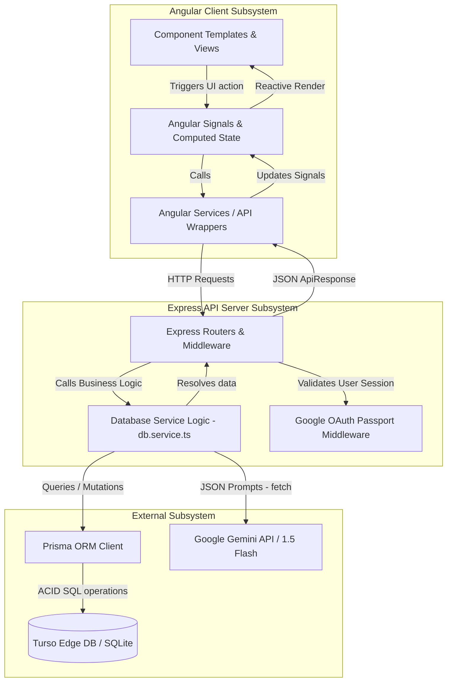
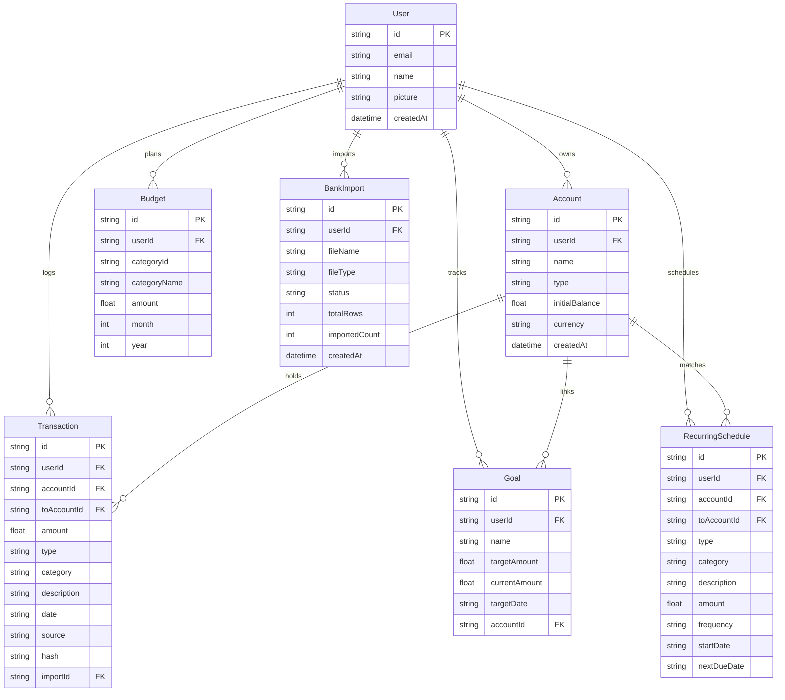

# TCFlow (FinTrack Pro) — Technical Architecture & System Wireframe

Welcome to the technical documentation and architecture wireframe for TCFlow (FinTrack Pro), a premium personal finance application. This document details how the frontend and backend parts coordinate, how the database is structured, how the AI features work, and how data flows through the application.

---

## 📐 System Architecture Diagram

Below is the high-level data flow diagram showing how the Angular 18+ SSR client, Express API server, Turso Edge Database (SQLite), and Google Gemini AI services interact.



---

## 🗂️ Project Directory Wireframe

The codebase is split into a **standalone Angular application** (frontend) and an **Express server** (backend) co-existing in the same workspace.

```
Expensetracker/
├── angular.json                     # Angular CLI build configuration
├── package.json                     # Dependencies and run scripts
├── tsconfig.json                    # Project TypeScript compiler rules
├── prisma/
│   └── schema.prisma                # Prisma ORM Database Models & Relations
├── src/
│   ├── main.ts                      # Frontend Client bootstrapping entry
│   ├── main.server.ts               # Frontend Server-Side Rendering entry
│   ├── server.ts                    # Express Server entry & Server-Side Rendering Handler
│   ├── styles.css                   # Global CSS rules, theme variables, and shared layout classes
│   ├── app/
│   │   ├── app.routes.ts            # Angular client routes map (lazy loaded)
│   │   ├── app.ts                   # App root component (Layout structural grid)
│   │   ├── core/                    # Core Subsystem (services, models, guards)
│   │   │   ├── guards/              # AuthGuards to protect private pages
│   │   │   ├── models/              # TypeScript Interfaces (Transaction, Account, Goal, etc.)
│   │   │   └── services/            # Shared Singleton API state management services
│   │   │       ├── api.service.ts   # Core HTTP endpoint wrapper
│   │   │       ├── auth.service.ts  # Handles user session & profile credentials
│   │   │       ├── goal.service.ts  # State manager for savings milestones
│   │   │       └── transaction.service.ts # State manager for transactions list & filters
│   │   └── features/                # Views & UI Components
│   │       ├── dashboard/           # Financial summaries, Net Worth, widget layouts
│   │       ├── transactions/        # Manual inputs, filters, CSV bank imports, Quick Log
│   │       ├── budgets/             # Interactive 3-tier variable budget optimizer
│   │       ├── goals/               # savings rings & AI Goal Buddy advisor modal
│   │       └── reports/             # Outflow heatmaps, Sunburst charts, on-demand AI Audits
│   └── server/                      # Server-side business logic
│       ├── api.routes.ts            # Express /api/ endpoints handler definitions
│       ├── db.service.ts            # Prisma queries, local heuristics matching, and Gemini API fetching
│       └── auth/                    # Google OAuth authentication routers
```

---

## 🗄️ Database Wireframe & Schema Relations

The database uses **Turso (SQLite at the edge)** managed via **Prisma**. Below is a map of the data models and how they relate.



---

## 🔄 Core Data Flow Wireframes

### 1. Zero-Hit Local Categorization vs Batch AI Import
When importing bank transactions from a CSV file, TCFlow protects your Google Gemini API limits by doing local matching first.

```mermaid
sequenceDiagram
    autonumber
    actor User as Client (Browser)
    participant Route as Express Router (/api/ai/predict-batch)
    participant DB as db.service.ts
    participant Turso as Turso Database
    participant AI as Gemini API

    User->>Route: Upload CSV File rows
    Route->>DB: findLocalHeuristicCategory(userId, descriptions)
    DB->>Turso: Scan past transactions matching description
    Turso-->>DB: Returns matching categories (e.g. Subway -> Food)
    Note over DB: Matches mapped locally (0 API hits!)
    
    rect rgb(28, 32, 48)
        Note right of DB: Batch fallback for remaining unmapped rows
        DB->>AI: Send array of remaining descriptions in 1 batch call
        AI-->>DB: Returns predicted category IDs array (1 API hit!)
    end

    DB-->>Route: Return combined mapping record
    Route-->>User: Render reviewed rows with mapped categories
```



---

## 🤖 Gemini AI Integrations Blueprint

TCFlow leverages Google Gemini 1.5 Flash to power four main smart modules on-demand:

### 1. Natural Language Logging
*   **Method**: `parseNaturalLanguageLog(userId, sentence, clientDate)` in [db.service.ts](file:///d:/Projects/ExpenseTracker/Expensetracker/src/server/db.service.ts)
*   **Concept**: Parses arbitrary text (e.g., *"Spent $14.50 at McDonalds yesterday"*) using Gemini to extract a structured JSON object containing:
    *   `amount`: `14.50`
    *   `type`: `"expense"`
    *   `description`: `"McDonalds"`
    *   `date`: `[computed date based on yesterday relative to clientDate]`
    *   `category`: `"food"` (categorized against existing category schemas)
*   **API Cost**: **1 hit per trigger** (user clicks `✨ Fill` next to the textarea).

### 2. Variable Cost Budget Optimizer
*   **Method**: `optimizeBudgets(userId)` in [db.service.ts](file:///d:/Projects/ExpenseTracker/Expensetracker/src/server/db.service.ts)
*   **Concept**: Identifies discretionary spending categories (ignoring fixed costs like rent, utilities, insurance). Gemini analyzes the past 1,000 historical expense rows to suggest 3 levels of target cuts:
    *   **Conservative** (~10% cuts)
    *   **Moderate** (~20% cuts)
    *   **Aggressive** (~35% cuts)
*   **API Cost**: **1 hit per click** (user clicks `🔮 Optimize with AI` on Budgets page).

### 3. Goal Buddy Advisor
*   **Method**: `evaluateGoalBuddy(userId, goalId)` in [db.service.ts](file:///d:/Projects/ExpenseTracker/Expensetracker/src/server/db.service.ts)
*   **Concept**: Compares a specific financial savings target amount, current progress, and remaining timeline against the user's average 3-month cashflow surplus (income - expenses).
*   **Output Schema**:
    ```json
    {
      "status": "on_track" | "off_track",
      "buddyMessage": "Friendly, personal finance companion advice text...",
      "suggestedActions": ["Checkbox bullet point action 1", "Action 2"]
    }
    ```
*   **API Cost**: **1 hit per check** (user clicks `💬` on a Goal card).

### 4. Executive Financial Report Audits
*   **Method**: `getAiAdvice(...)` and `getExecutiveReport(...)` in [db.service.ts](file:///d:/Projects/ExpenseTracker/Expensetracker/src/server/db.service.ts)
*   **Concept**: Instead of running automatically on page load, these audits display local statistics (heuristic averages) on load. Clicking `🔮 Generate AI Executive Insights` calls Gemini once and caches the detailed textual analysis for the rest of the session.
*   **API Cost**: **1 hit per period check** (only when manually triggered by the user).

---

## 🛠️ Developer Scripts & Tools

Run the following commands inside the workspace root:

*   **Install Dependencies**:
    ```bash
    npm install
    ```
*   **Generate Prisma client**:
    ```bash
    npx prisma generate
    ```
*   **Run Developer Server (Angular dev server)**:
    ```bash
    npm run dev
    ```
*   **Build Production Application (SSR + Client bundle)**:
    ```bash
    npm run build
    ```
*   **Run Production App Server (Node host)**:
    ```bash
    npm run start
    ```
